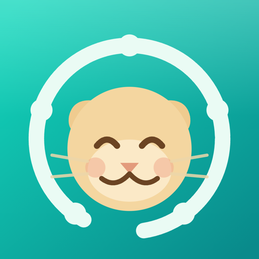

<p align="center"></p>

# Signal Crew

> **One dashboard for everything that keeps a small team alive — work, goals, communication, and finance — orchestrated by AI agents.**

📱 **Status:** iOS — beta testing (TestFlight)
🌐 **Homepage:** [시그널크루.com](https://xn--2i0bs2de2jevkc6q.com)
🇰🇷 한국어 요약은 [README.ko.md](./README.ko.md)를 참고하세요.

---

## Why

Why comes first. Building comes next.

Solo founders and small teams don't fail because they lack tools — they fail because their reality is **fragmented across too many tools**. Tasks live in one app, schedules in another, goals in a doc, conversations in a messenger, and finances in a spreadsheet. Nobody can see the whole picture.

I kept asking: *why does understanding the state of your own business require opening five apps?*

Signal Crew is my answer.

## Problem

- Work, schedules, goals, communication, and financial data are scattered across separate services.
- Context-switching between tools destroys focus and hides the true state of a project.
- Existing all-in-one tools are built for large organizations — too heavy, too complex, and not AI-native.
- Solo founders and small teams need **synthesis**, not another silo.

## Solution

An AI-native SaaS and mobile app that unifies work, collaboration, and finance into a single integrated dashboard:

- **Integrated dashboard** — tasks, schedules, goals, communication, and finances in one view
- **AI agent layer** — agents that collect, summarize, and surface what actually needs your attention
- **Built for small teams** — solo founders, internal projects, and small crews, not enterprise bureaucracy
- **Measured, not guessed** — full GA4 / GTM event instrumentation from day one, so product decisions follow real usage data

## Architecture

```
┌─────────────────────────────────────────────┐
│                Mobile / Web App             │
│        (Integrated Dashboard UI/UX)         │
├─────────────────────────────────────────────┤
│               AI Agent Layer                │
│   collect → summarize → prioritize → alert  │
├──────────────┬──────────────┬───────────────┤
│  Work/Goals  │ Communication│    Finance    │
│    module    │    module    │    module     │
├──────────────┴──────────────┴───────────────┤
│         Backend & Data  <!-- TODO -->       │
├─────────────────────────────────────────────┤
│      Analytics: GA4 · GTM event tracking    │
└─────────────────────────────────────────────┘
```

<!-- TODO: replace with actual architecture diagram (docs/architecture.png) -->

## Stack

| Layer | Technology |
|---|---|
| AI | LLM-based agents, prompt-engineered workflows <!-- TODO: specify models/APIs --> |
| App | Mobile — iOS beta via TestFlight <!-- TODO: framework --> |
| Backend | <!-- TODO: e.g. Firebase / Supabase --> |
| Analytics | GA4, GTM (event & funnel instrumentation) |
| Dev workflow | Google AI Studio → Antigravity / Claude Code → Codex review & testing |

## Demo

<!-- TODO: add screenshots -->
<!--  -->
<!-- App Store link: TODO -->

## My Role

Founder / Product Builder — end to end:

problem discovery → target user & core value definition → integrated dashboard design → UI/UX → AI feature direction → GA4/GTM measurement design → TestFlight beta release.

## Future

- [ ] App Store / Google Play public release
- [ ] Deeper AI agent orchestration (multi-agent workflows via MCP)
- [ ] Local LLM (sLLM) options for privacy-sensitive financial data
- [ ] Team collaboration features expansion

---

**Note:** This repository contains the public documentation and architecture of Signal Crew. API keys, secrets, database schemas, and customer data are not included.

*Built by [Derrick Hwang](https://github.com/kordp888) — AI Native Product Manager. Why comes first. Building comes next.*
